<div align="center">

# 🛡️ PROGÖZ

### Proaktif Yapay Zekâ Destekli Gözetim Sistemi

**Kayıt almakla yetinmeyen; izleyen, anlayan ve uyaran güvenlik platformu.**

PROGÖZ; güvenlik kameralarından, web yayınlarından veya yüklenen videolardan gelen görüntülerde
**kavga, fiziksel saldırı, yakın temaslı şiddet ve anomali** sinyallerini gerçek zamanlı tespit eder,
olayları gruplar, araç **plakalarını okur** ve bunları sade bir panel ile mobil uygulamada sunar.

<br/>


</div>

---

## 📑 İçindekiler

- [Genel Bakış](#-genel-bakış)
- [Öne Çıkan Özellikler](#-öne-çıkan-özellikler)
- [Ekran Görüntüleri (Web)](#-ekran-görüntüleri--web-paneli)
- [Mobil Uygulama](#-mobil-uygulama)
- [Sistem Mimarisi](#-sistem-mimarisi)
- [Bilgisayarlı Görü Pipeline'ı](#-bilgisayarlı-görü-pipelineı)
- [Incident / Olay Sistemi](#-incident--olay-sistemi)
- [Plaka Tanıma](#-plaka-tanıma)
- [Analiz Modları & Alarm Eşikleri](#-analiz-modları--alarm-eşikleri)
- [Teknoloji Yığını](#-teknoloji-yığını)
- [Tasarım & Tema](#-tasarım--tema)
- [Kurulum](#-kurulum)
- [Çalıştırma](#-çalıştırma)
- [API Endpoint Özeti](#-api-endpoint-özeti)
- [Model Eğitimi](#-model-eğitimi)
- [Testler](#-testler)
- [Güvenlik Notları](#-güvenlik-notları)
- [Lisans](#-lisans)

---

## 🔎 Genel Bakış

Klasik kamera sistemleri yalnızca görüntü kaydeder; bir olay yaşandığında saatlerce kayıt izlemek
gerekir. **PROGÖZ bu yaklaşımı tersine çevirir:** görüntüyü canlı olarak analiz eder, riskli durumları
skorlar, ardışık riskli kareleri tek bir **olay (incident)** altında gruplar ve operatöre yalnızca
gerçekten önemli olanı gösterir.

Sistem üç ana katmandan oluşur:

| Katman | Teknoloji | Görev |
|---|---|---|
| 🧠 **Backend** | FastAPI + PyTorch + OpenCV | CV analizi, skorlama, plaka OCR, API, WebSocket |
| 💻 **Web Paneli** | React + Vite + TypeScript | Canlı izleme, video analizi, olay & plaka yönetimi |
| 📱 **Mobil Uygulama** | Flutter + Firebase | Anlık bildirim (FCM), olay ve plaka takibi |

PROGÖZ; tek kişinin hareketine değil, **kişi çiftleri arasındaki etkileşime** odaklanan bir skorlama
modeli kullanır. Bu sayede koşan, el sallayan veya kalabalıkta yürüyen insanları gerçek bir
fiziksel çatışmadan ayırt edebilir.

---

## ✨ Öne Çıkan Özellikler

**Analiz & Tespit**
- 🥊 Kavga / fiziksel saldırı / yakın temaslı şiddet tespiti
- 🤝 Kişi çifti etkileşimi tabanlı skorlama (proximity + mutual energy + pose contact)
- 👥 Kalabalık sahnelerde false-positive azaltan filtreler
- 🏃 YOLOv8n-Pose + **BoT-SORT** ile kararlı kişi takibi (track ID kalıcılığı)
- 🔢 OpenCV frame-differencing + Farneback optical flow ile hareket enerjisi
- 🚗 Araç tespiti & takibi, vote-buffer tabanlı **plaka okuma (OCR)**

**Kaynaklar**
- 📁 Video dosyası yükleyip arka planda analiz (MP4 / AVI / MKV …)
- 📷 Webcam / RTSP kayıtlı kamera ile canlı analiz
- 🌐 Web yayını (HLS m3u8 / RTSP / RTMP / YouTube) URL'sinden canlı analiz
- 🔌 Sunucuya fiziksel bağlı webcam'lerin otomatik taranması

**Operasyon**
- 📊 Gerçek zamanlı dashboard: aktif kamera, günlük olay ve plaka istatistikleri
- 🧩 Frame spam yerine gruplanmış **Incident** sistemi (max/avg skor, süre, timeline, best snapshot)
- ⏹️ Analiz sırasında **"Analizi Durdur"** ile temiz iptal desteği
- ✅ Olayları *doğru olay / yanlış alarm / yoksay* olarak işaretleme
- 🔔 WebSocket ile canlı ilerleme + Firebase Cloud Messaging ile mobil push
- ⚡ CUDA varsa GPU, yoksa otomatik CPU fallback

---

## 🖥️ Ekran Görüntüleri — Web Paneli

> Renkler yalnızca anlam taşır:
> 🟢 çevrimiçi/sağlıklı · 🔴 kavga/tehlike · 🟠 uyarı/şüpheli.

### Giriş Akışı

Açılışta kullanıcıyı yatay kayan tipografi animasyonlu bir **splash** ekranı karşılar; "Sistemi Başlat"
ile sade bir giriş formuna geçilir.

<div align="center">
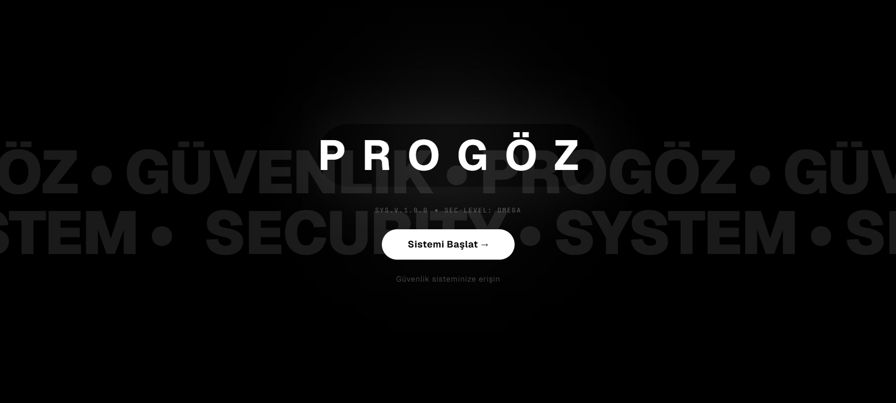
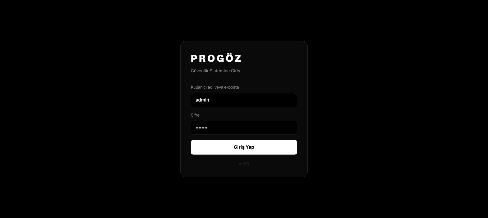
</div>

### Dashboard

Aktif kamera sayısı, günlük olaylar, tespit edilen benzersiz plakalar ve **sistem/CUDA durumu**;
son 24 saatin olay dağılımı grafiği ve son olaylar akışı.

<div align="center">
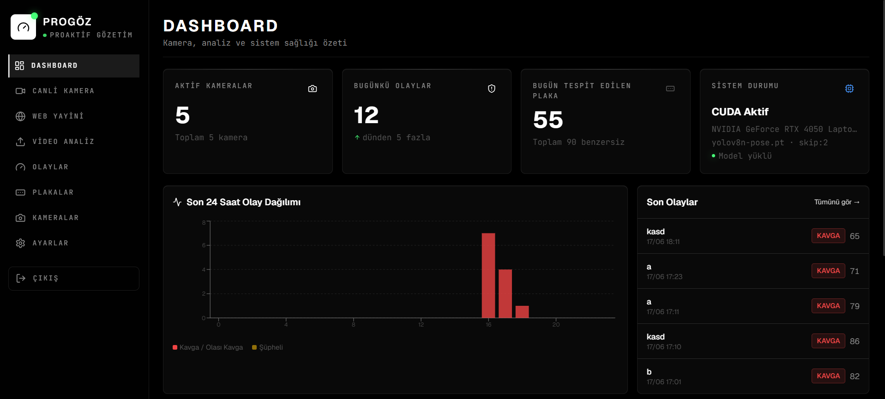
</div>

### Canlı Kamera & Web Yayını

Canlı görüntü üzerinde anlık alarm skoru, FPS ve gecikme bilgisi. Web Yayını sayfasından
HLS/RTSP/RTMP veya YouTube bağlantısı girilerek model doğrudan akışı analiz eder.

<div align="center">
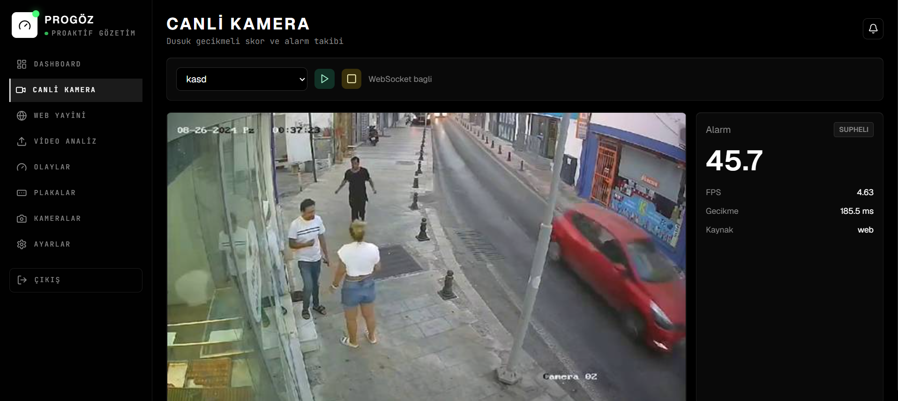
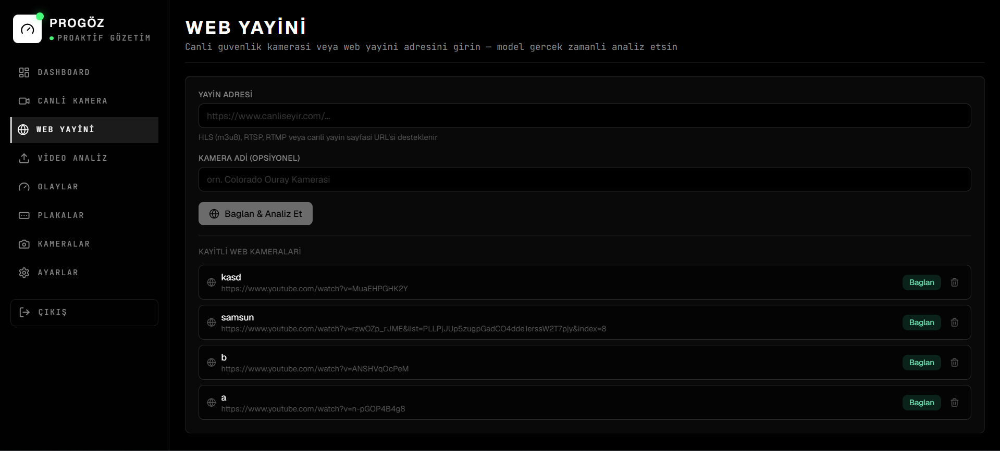
</div>

### Video Analizi

Video yükle, modu seç (Hızlı / Dengeli / Detaylı), plaka tanıma ve "sadece olaylar" gibi seçenekleri
işaretle; ilerlemeyi gerçek zamanlı izle.

<div align="center">
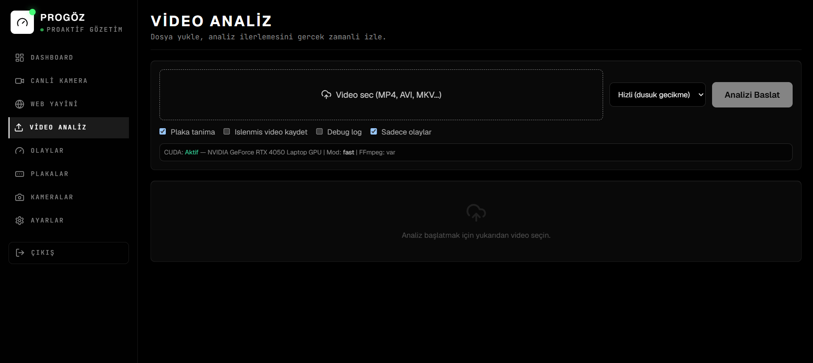
</div>

### Olaylar & Incident Detayı

Olaylar listesi seviye (KAVGA / OLASI KAVGA / ŞÜPHELİ) ve kaynağa göre filtrelenir. Incident
detayında en yüksek skorlu kare **annotasyonlu** gösterilir; skor timeline'ı, ilgili track ID'leri ve
max/ortalama skor yer alır.

<div align="center">
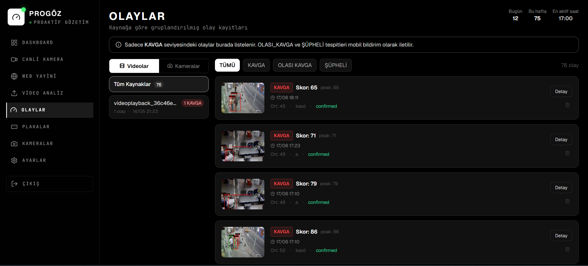
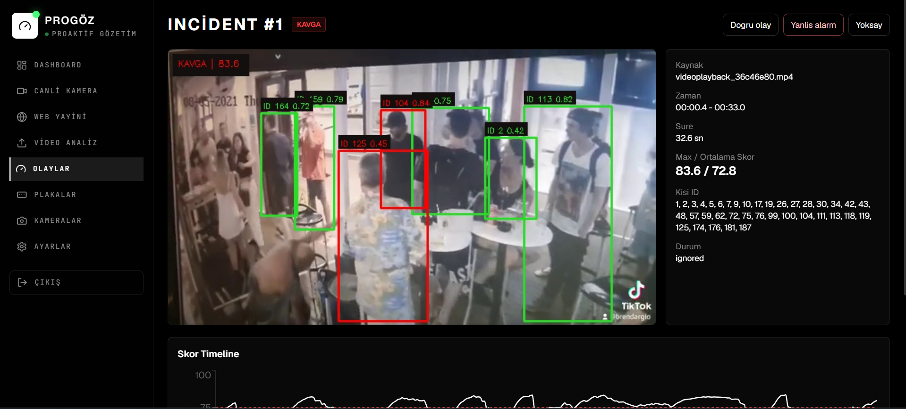
</div>

### Plaka Tanıma

Okunan plakalar güven yüzdesi ve görülme sayısıyla birlikte listelenir; detay görünümünde plaka
kırpıntısı büyütülür ve okuma istatistikleri sunulur.

<div align="center">
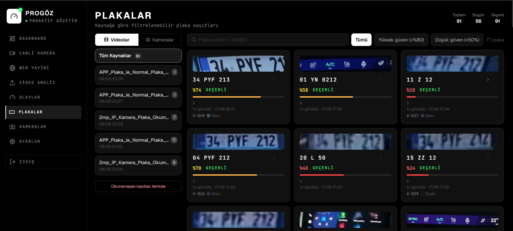
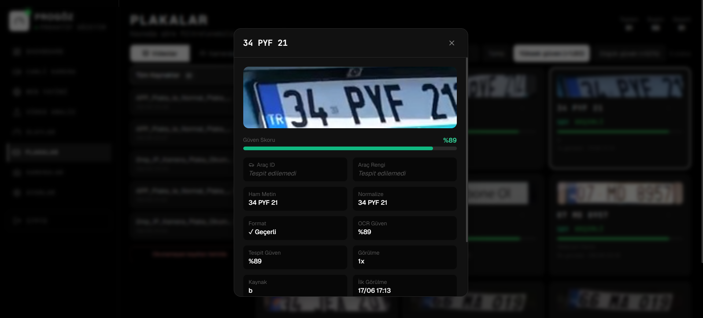
</div>

### Kamera Yönetimi & Ayarlar

Webcam/RTSP kaynakları ekle, başlat/durdur, plaka tanımayı kamera bazında aç/kapat. Ayarlar
sayfasında analiz parametreleri ve alarm eşikleri görüntülenir.

<div align="center">
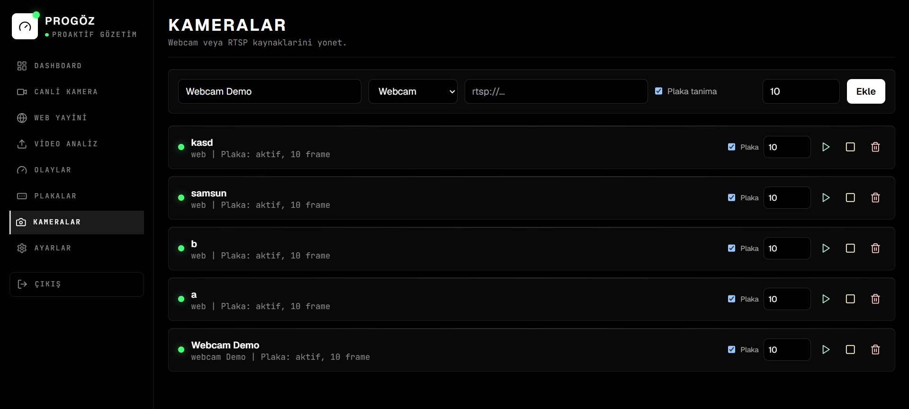
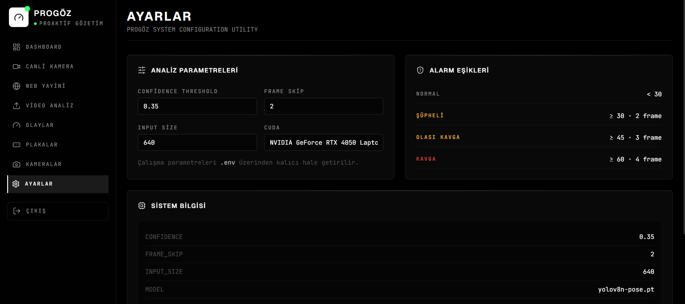
</div>

---

## 📱 Mobil Uygulama

Flutter ile geliştirilen **PROGÖZ Mobile**, "Obsidian Sentinel" monokrom temasıyla web paneliyle aynı
dili konuşur. Firebase Cloud Messaging üzerinden kavga ve plaka tespitlerinde **anlık bildirim** alır;
olayları, plakaları ve ayarları cepten yönetir.

<div align="center">
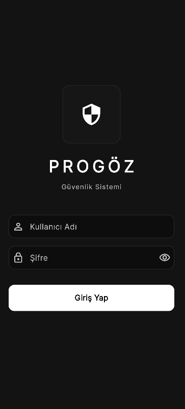
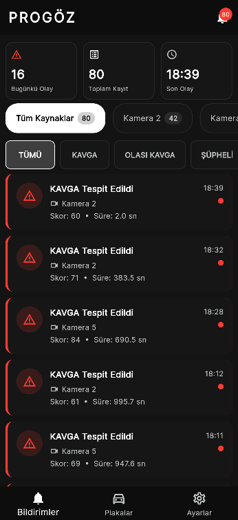
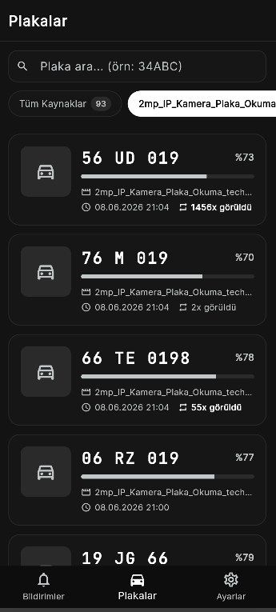
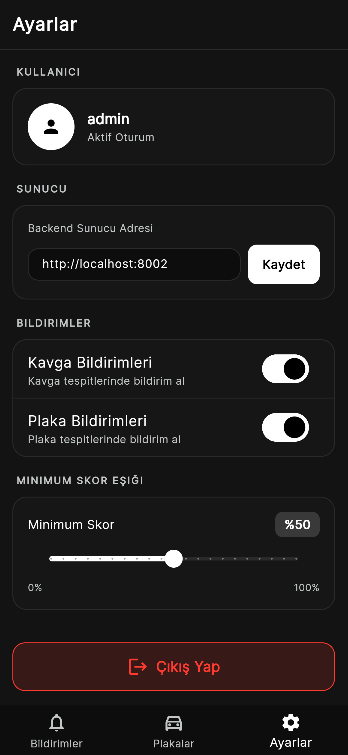
</div>

| Ekran | İçerik |
|---|---|
| **Giriş** | JWT tabanlı oturum açma |
| **Bildirimler** | Günlük olay/kayıt özeti, kaynak ve seviye filtreleri, canlı olay akışı |
| **Plakalar** | Aranabilir plaka listesi, güven yüzdesi ve görülme sayısı |
| **Ayarlar** | Backend adresi, kavga/plaka bildirim anahtarları, minimum skor eşiği |

---

## 🏗️ Sistem Mimarisi

```text
PROGÖZ
├── backend/                      # FastAPI uygulaması
│   └── app/
│       ├── api/                  # auth, camera, upload, event, incident,
│       │                         # plate, system, tracked_person, stream (WS)
│       ├── core/                 # detector, motion_analyzer, scoring,
│       │                         # video_processor, camera_stream, alarm_manager,
│       │                         # plate_detector/ocr/pipeline, fight_classifier,
│       │                         # tracker (BoT-SORT), performance_monitor
│       ├── models/               # SQLAlchemy: user, camera, analysis_job,
│       │                         # event, incident, license_plate, tracked_person
│       ├── schemas/              # Pydantic v2 request/response modelleri
│       ├── services/             # auth, camera, upload, incident, plate,
│       │                         # stream_extractor, websocket_manager,
│       │                         # vehicle_tracker, person_registry, notification
│       ├── utils/                # ffmpeg, file, time yardımcıları
│       └── static/               # uploads, processed, snapshots, clips, plate_crops
│   ├── ml/                       # model dosyaları + eğitim scriptleri (fight, plates, pose)
│   └── requirements.txt
├── frontend/                     # React + Vite + TypeScript
│   └── src/
│       ├── pages/                # Dashboard, LiveCamera, WebStream, VideoUpload,
│       │                         # Events, EventDetail, Plates, Cameras,
│       │                         # PersonTracking, Settings, Login, Register
│       ├── components/           # Layout (sidebar), SeverityBadge, StatCard
│       └── api/                  # Axios client + WebSocket
├── progoz_mobile/                # Flutter mobil uygulama
│   └── lib/
│       ├── screens/              # login, home, event_detail, plates, settings
│       ├── providers/            # auth, incidents, plates, settings (Provider)
│       ├── services/             # api, auth, notification (FCM)
│       └── config/               # api_config, theme
├── docs/                         # Mimari, CV algoritması, kurulum, eğitim dokümanları
│   └── screenshots/              # Bu README'deki web & mobil ekran görüntüleri
├── scripts/                      # create_admin vb. yardımcı scriptler
└── tests/                        # pytest
```

---

## 🧠 Bilgisayarlı Görü Pipeline'ı

1. Video / webcam / RTSP / web yayını kaynağı **OpenCV** ile okunur.
2. **YOLOv8n-Pose** her karede kişileri ve iskelet (pose) noktalarını tespit eder.
3. **BoT-SORT** takibi kişilere kararlı bir `track_id` atar (ID kaymasını en aza indirir).
4. Her kişi için hareket enerjisi, hız, bbox değişimi ve **optical flow** sinyalleri hesaplanır.
5. Skorlama tek kişiye değil, **kişi çiftlerinin etkileşimine** odaklanır.
6. Proximity ve bbox overlap yalnızca *aday* sinyaldir; tek başına kavga sayılmaz.
7. Mutual energy, mutual chaos, relative motion, temporal persistence ve pose/contact sinyalleri
   birlikte değerlendirilir.
8. Alarm skorundan kare düzeyinde karar üretilir.
9. Ardışık riskli kareler **IncidentTracker** ile tek bir olay altında gruplanır.
10. Olay içindeki en yüksek skorlu kare **best snapshot** olarak kaydedilir.

> Ayrıntılı algoritma açıklaması için: [`docs/CV_ALGORITHM.md`](docs/CV_ALGORITHM.md)

---

## 🧩 Incident / Olay Sistemi

PROGÖZ her yüksek skorlu kareyi ayrı ayrı göstermek yerine olayları gruplar. Bir incident kaydı şunları içerir:

- **Kaynak tipi**: video veya kamera (+ video dosyası / kamera id)
- **Zaman**: başlangıç, bitiş ve toplam süre
- **Skor**: maksimum ve ortalama skor + tam **score timeline**
- **Seviye**: `SUPHELI`, `OLASI_KAVGA`, `KAVGA`
- **İlgili track id'leri** ve **best snapshot**
- **Durum**: `confirmed`, `false_positive`, `ignored`

---

## 🚗 Plaka Tanıma

Video yükleme ve canlı kamera akışları opsiyonel plaka tanıma destekler.

- **Detector**: YOLO tabanlı `backend/ml/models/plates/license_plate_detector.pt`. Model yoksa plaka
  pipeline'ı sessizce atlanır.
- **Vote Buffer**: Her karede ayrı kayıt yazmak yerine OCR sonuçları bellekte toplanır. Video analizinde
  analiz bitince, canlı akışta her 300 karede bir ve akış durduğunda *kazanan* plaka tek kayıt olarak yazılır.
- **Fuzzy Matching**: Benzer okumalar (%75 eşik) tek plaka altında birleştirilir; mükerrer kayıt engellenir.
- **OCR**: Varsayılan motor **EasyOCR**; sonuçlar Türkiye plaka formatına normalize edilir.

> Ayrıntı için: [`docs/PLATE_RECOGNITION.md`](docs/PLATE_RECOGNITION.md)

---

## ⚙️ Analiz Modları & Alarm Eşikleri

Varsayılan mod `fast`'tır.

| Mod | Kullanım | Özellik |
|---|---|---|
| `realtime` | Canlı kamera | Düşük gecikme |
| `fast` | Demo video | 640 input, frame skip, hızlı olay çıkarma |
| `balanced` | Dengeli | Kalite / hız dengesi |
| `accurate` | Detaylı | Daha yavaş, daha çok kare analizi |

**Alarm eşikleri** (skor → seviye):

| Seviye | Eşik | Onay |
|---|---|---|
| 🟢 NORMAL | `< 30` | — |
| 🟠 ŞÜPHELİ | `≥ 30` | 2 kare |
| 🟠 OLASI KAVGA | `≥ 45` | 3 kare |
| 🔴 KAVGA | `≥ 60` | 4 kare |

> Analiz parametreleri (confidence `0.35`, frame skip `2`, input size `640`, model `yolov8n-pose.pt`)
> `.env` üzerinden kalıcı hale getirilebilir.

---

## 🛠️ Teknoloji Yığını

**Backend**
- Python 3.10+ · FastAPI · Uvicorn
- SQLAlchemy 2.0 · SQLite · Pydantic v2 · pydantic-settings
- PyTorch · TorchVision · **Ultralytics YOLOv8** · BoT-SORT (lap)
- OpenCV (+contrib) · NumPy · SciPy
- EasyOCR · RapidFuzz / TheFuzz / python-Levenshtein
- python-jose (JWT) · passlib + bcrypt
- yt-dlp (web yayını) · onvif-zeep · APScheduler · psutil · firebase-admin (FCM)

**Frontend**
- React 18 · Vite 5 · TypeScript 5
- Tailwind CSS 3 (monokrom tema) · Framer Motion
- Recharts · Lucide React · Axios · WebSocket

**Mobil**
- Flutter · Provider
- Firebase Core + Messaging (FCM) · flutter_local_notifications
- http · shared_preferences · cached_network_image · google_fonts

---

## 🎨 Tasarım & Tema

PROGÖZ, tamamen **siyah / beyaz / gri monokrom** bir tema kullanır (teal/cyan yoktur). Renkler yalnızca
durum bildirir.

| Token | Değer | | Token | Değer |
|---|---|---|---|---|
| Background | `#000000` | | Border | `#2a2a2a` |
| Surface | `#0f0f0f` | | Text Primary | `#ffffff` |
| Card | `#141414` | | Text Secondary | `#888888` |
| Sidebar BG | `#080808` | | Accent | `#ffffff` |
| Danger (KAVGA) | `#ef4444` | | Warning (ŞÜPHELİ) | `#f59e0b` |
| Success (Online) | `#4ade80` | | | |

- **Butonlar**: primary beyaz/siyah, secondary koyu gri
- **Severity Badge**: KAVGA → kırmızı, OLASI_KAVGA → amber, ŞÜPHELİ → gri
- **Grafikler**: Recharts, monokrom ızgara ve beyaz çizgiler
- **Geçişler**: 150ms ease, ince 4px scrollbar

---

## 📦 Kurulum

> Detaylı adımlar için: [`docs/INSTALLATION.md`](docs/INSTALLATION.md)

### 1) Backend (Windows / PowerShell)

```powershell
cd backend
python -m venv venv
.\venv\Scripts\Activate.ps1
pip install -r requirements.txt
```

İlk admin kullanıcısını proje kök dizininden oluştur:

```powershell
python scripts/create_admin.py --username admin --email admin@progoz.app --password admin123
```

Demo giriş bilgisi:

```
Kullanıcı adı: admin
Şifre:         admin123
```

> ⚠️ `admin123` yalnızca demo içindir; gerçek kullanımda mutlaka değiştirin.

### 2) Frontend

```powershell
cd frontend
npm install
```

### 3) Mobil (opsiyonel)

```powershell
cd progoz_mobile
flutter pub get
```

> Firebase yapılandırma dosyaları (`google-services.json`, `GoogleService-Info.plist`) repoya dâhil
> değildir; FCM bildirimleri için kendi Firebase projenizi bağlayın.

---

## ▶️ Çalıştırma

**Backend:**

```powershell
cd backend
.\venv\Scripts\Activate.ps1
uvicorn app.main:app --reload
```

**Frontend:**

```powershell
cd frontend
npm run dev
```

**Mobil:**

```powershell
cd progoz_mobile
flutter run
```

Adresler:

```
Web panel:    http://127.0.0.1:5173
Backend API:  http://127.0.0.1:8000
API Docs:     http://127.0.0.1:8000/docs
```

### Demo Akışı

1. `http://127.0.0.1:5173` adresine git, splash ekranında **Sistemi Başlat →** de.
2. `admin / admin123` ile giriş yap.
3. Dashboard'da CUDA ve sistem durumunu kontrol et.
4. **Video Analiz** sayfasından demo video yükle, (opsiyonel) plaka tanımayı aç, Hızlı modda başlat.
5. **Olaylar** sayfasında incident listesini ve detayında best snapshot + skor timeline'ı incele.
6. **Plakalar** sayfasında okunan plakaları gör.
7. **Canlı Kamera** / **Web Yayını** ile gerçek zamanlı analiz dene.

---

## 🔌 API Endpoint Özeti

**Auth**
- `POST /api/auth/login` · `GET /api/auth/me`

**Video Analiz**
- `POST /api/uploads/analyze`
- `GET /api/uploads/jobs` · `GET /api/uploads/jobs/{job_id}/result`
- `POST /api/uploads/jobs/{job_id}/cancel` · `GET /api/uploads/jobs/{job_id}/incidents`

**Incident**
- `GET /api/incidents` · `GET /api/incidents/{id}` · `PUT /api/incidents/{id}/status`

**Kamera**
- `GET /api/cameras` · `POST /api/cameras` · `GET /api/cameras/devices`
- `POST /api/cameras/webcam/start` · `POST /api/cameras/webcam/stop`
- `GET /api/cameras/{id}` · `PUT /api/cameras/{id}` · `DELETE /api/cameras/{id}`
- `POST /api/cameras/{id}/start` · `POST /api/cameras/{id}/stop`

**Plaka**
- `GET /api/plates` · `DELETE /api/plates/{id}`
- `POST /api/plates/cleanup-unreadable` · `POST /api/plates/deduplicate`

**Sistem & Akış**
- `GET /api/system/status` · WebSocket akış uç noktaları (`stream_routes`)

> Tam liste için: [`docs/API_DOCUMENTATION.md`](docs/API_DOCUMENTATION.md) ve canlı Swagger: `/docs`

---

## 🎓 Model Eğitimi

Kavga/şiddet modeli video clip classification olarak eğitilir:

```powershell
cd backend
python ml/training/fight/prepare_fight_dataset.py --raw ml/datasets/fight/raw --out ml/datasets/fight/processed --clear
python ml/training/fight/train_fight_classifier.py --epochs 20 --batch-size 4 --clip-len 16 --device cuda
python ml/training/fight/evaluate_fight_classifier.py --model ml/models/fight/fight_classifier.pt --data ml/datasets/fight/processed/test
```

> Ayrıntılar: [`docs/FIGHT_MODEL_TRAINING.md`](docs/FIGHT_MODEL_TRAINING.md) ·
> [`docs/PLATE_MODEL_TRAINING.md`](docs/PLATE_MODEL_TRAINING.md)

---

## ✅ Testler

```powershell
pytest
```

---

## 🔐 Güvenlik Notları

- `.env`, veritabanı ve üretilen medya dosyaları `.gitignore` ile repoya eklenmez.
- Şifreler bcrypt ile hashlenir, oturumlar JWT ile yönetilir.
- Yüklenen dosya uzantıları kontrol edilir.
- Firebase admin/hassas anahtar dosyaları repo dışında tutulur.

---

## 📄 Lisans

Bu proje eğitim ve final proje sunumu amacıyla hazırlanmıştır. Ayrıntılar için
[`LICENSE`](LICENSE) dosyasına bakınız.

<div align="center">
<br/>
<sub>PROGÖZ · Proaktif Gözetim Sistemi — <strong>izleyen, anlayan, uyaran güvenlik.</strong></sub>
</div>
